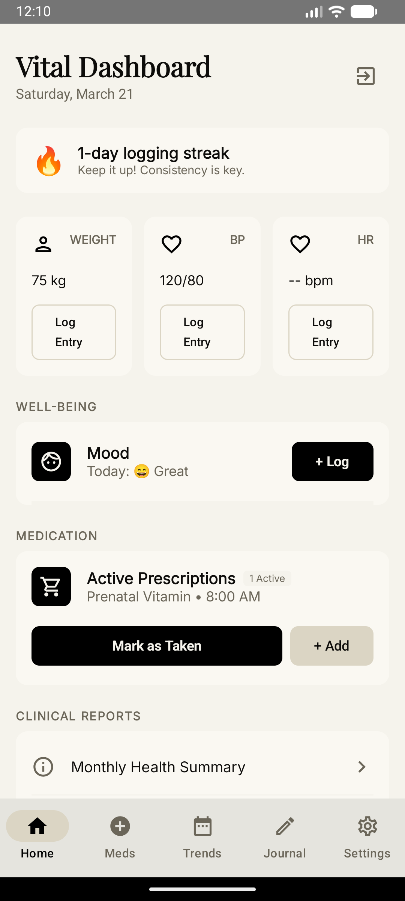
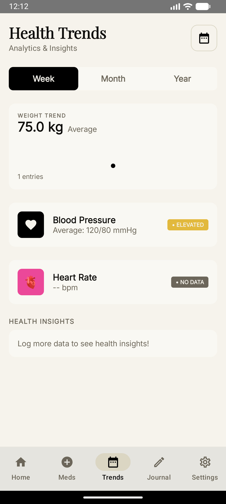
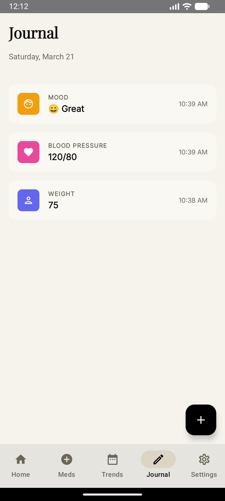
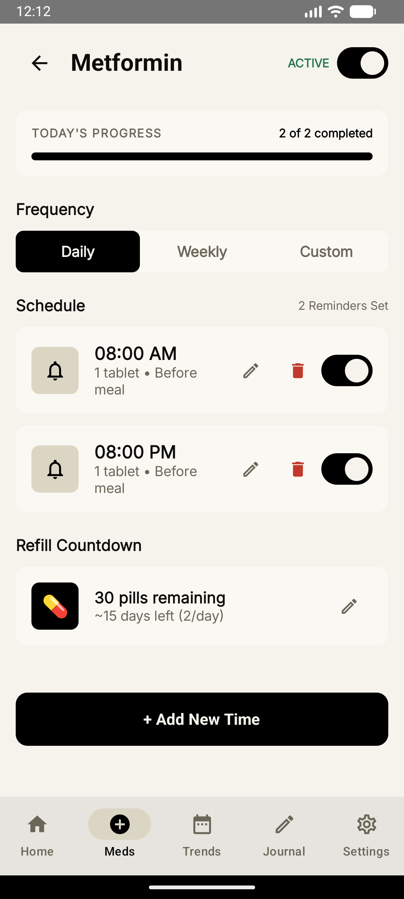
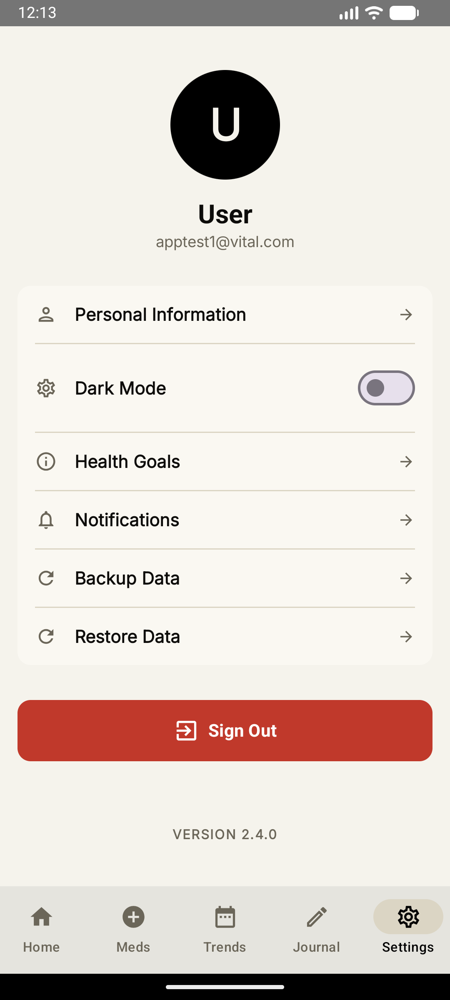

<div align="center">

# VITAL Health — Android

**A premium, offline-first health tracking app built with Jetpack Compose & Supabase**

[](https://kotlinlang.org)
[](https://developer.android.com/jetpack/compose)
[](https://supabase.com)
[](LICENSE)

</div>

---

## Screenshots

| Dashboard | Trends | Journal |
| :---: | :---: | :---: |
|  |  |  |

| Medications | Settings |
| :---: | :---: |
|  |  |

---

## Features

### Health Tracking

| Feature                   | Description                                                          |
| ------------------------- | -------------------------------------------------------------------- |
| **Weight Logging**        | Track weight with kg units, averages & trend charts                  |
| **Blood Pressure**        | Split systolic/diastolic input, status badges (Normal/Elevated/High) |
| **Heart Rate**            | BPM logging with min/max/avg analytics and status indicators         |
| **Mood Logging**          | Emoji-based mood picker with optional notes                          |
| **Medication Management** | Mark as taken, add new prescriptions, daily/weekly/custom frequency  |

### Smart Features

| Feature              | Description                                              |
| -------------------- | -------------------------------------------------------- |
| **Streak Counter**   | Tracks consecutive logging days to encourage consistency |
| **Trend Alerts**     | Dismissable warnings for elevated BP or high heart rate  |
| **Refill Countdown** | Tracks remaining pills and days until refill needed      |
| **Doctor Visit Log** | Schedule and track appointments with notes               |
| **Clinical Reports** | Monthly health summary + PDF export with share intent    |

### Trends & Analytics

- **Week / Month / Year** segmented filtering with real-time recalculation
- **Date Picker** — filter data from a specific date onward
- **Weight trend chart** — mini bar visualization with delta tracking
- **BP & HR analytics** — average values with color-coded status badges
- **Dynamic Health Insights** — pattern detection (morning vs evening BP, weight direction, HR trends)

### Journal

- **Daily health timeline** — chronological, color-coded entries
- **Free-form health notes** — via floating action button
- **All log types displayed** — weight, BP, HR, mood, medication, appointments

### Settings & Account

- **Onboarding flow** — 4-step setup (Welcome → Email/Password → Name → Goals)
- **Dark Mode** — warm espresso/charcoal palette that complements the light theme
- **Personal Information** — edit name & profile photo (stored in Supabase Storage)
- **Health Goals** — target weight, BP, daily steps, water intake
- **Notification Preferences** — medication reminders, vitals logging, weekly summaries
- **Cloud Backup/Restore** — sync health logs to/from Supabase PostgreSQL

---

## Tech Stack

| Layer          | Technology                                        |
| -------------- | ------------------------------------------------- |
| **Language**   | Kotlin 2.0                                        |
| **UI**         | Jetpack Compose (Material 3)                      |
| **DI**         | Dagger Hilt                                       |
| **Local DB**   | Room (SQLite)                                     |
| **Cloud**      | Supabase Kotlin SDK v3 (Auth, Postgrest, Storage) |
| **Network**    | Ktor Client                                       |
| **Async**      | Kotlin Coroutines & Flows                         |
| **PDF**        | Android PdfDocument API                           |
| **Images**     | Coil (async image loading)                        |
| **Typography** | Playfair Display + Inter (Google Fonts)           |

---

## Architecture

The app is built with a separated architecture that isolates UI logic from Data handling, improving testability and code maintainability:

- **UI Layer**: Built entirely with Jetpack Compose, consisting of `Screens` that consume states exposed by scoped `ViewModels`.
- **Data Layer**: Centralized through a `HealthRepository` that mediates between the **Local DB** (Room SQLite for offline-first capabilities) and the **Remote API** (Supabase for cloud sync and authentication).
- **DI Layer**: Dagger Hilt manages application-wide dependencies such as database instances and Auth managers.
- **Entry Point**: `MainActivity` serves as the host for Compose Navigation routing.

<div align="center">
  
</div>

> **Want to modify the Architecture Diagram?** 
> You can download the [`Architecture.drawio`](assets/Architecture.drawio) file from the `assets` directory and use the [Draw.io Integration extension](https://marketplace.visualstudio.com/items?itemName=hediet.vscode-drawio) in VS Code or [app.diagrams.net](https://app.diagrams.net/) to easily view and edit it interactively.

```text
com.vital.health/
├── data/
│   ├── local/           # Room DB (HealthLogEntity, HealthLogDao, VitalDatabase)
│   ├── remote/          # Supabase AuthManager
│   └── repository/      # HealthRepository (local + cloud sync)
├── di/                  # Hilt AppModule (Supabase, Room, AuthManager providers)
├── ui/
│   ├── screens/         # Compose screens (Dashboard, Auth, Onboarding, Settings, etc.)
│   ├── theme/           # Color.kt, Theme.kt, Type.kt (dynamic dark/light)
│   └── viewmodels/      # AuthViewModel, HealthViewModel
└── MainActivity.kt      # Entry point with auth/onboarding routing
```

---

## Getting Started

### Prerequisites

- Android Studio Iguana or newer
- JDK 17+
- A [Supabase](https://supabase.com) project

### Supabase Setup

1. Create a Supabase project
2. Enable **Email Auth** in Authentication settings
3. Create a `health_logs` table:
   ```sql
   CREATE TABLE health_logs (
     id TEXT PRIMARY KEY,
     "userId" UUID NOT NULL REFERENCES auth.users(id) ON DELETE CASCADE,
     "logType" TEXT NOT NULL,
     value TEXT NOT NULL,
     unit TEXT NOT NULL,
     notes TEXT,
     timestamp BIGINT NOT NULL,
     "isSynced" BOOLEAN DEFAULT TRUE
   );
   ALTER TABLE health_logs ENABLE ROW LEVEL SECURITY;
   CREATE POLICY "owner read"   ON health_logs FOR SELECT USING (auth.uid() = "userId");
   CREATE POLICY "owner insert" ON health_logs FOR INSERT WITH CHECK (auth.uid() = "userId");
   CREATE POLICY "owner update" ON health_logs FOR UPDATE USING (auth.uid() = "userId");
   CREATE POLICY "owner delete" ON health_logs FOR DELETE USING (auth.uid() = "userId");
   ```
4. Create an `avatars` storage bucket. Keep it **private** and add RLS policies that allow users to read/write only paths prefixed with their own `auth.uid()`.

### Configuration

1. Copy `.env.example` to `.env` at the project root and fill in `SUPABASE_URL` and `SUPABASE_KEY`.
2. For release builds, copy `keystore.properties.example` to `keystore.properties` and fill in your keystore credentials, **or** set `VITAL_KEYSTORE_PASSWORD`, `VITAL_KEY_ALIAS`, `VITAL_KEY_PASSWORD` as environment variables. Both files are gitignored.

> **Never commit production secrets, keystores, or their passwords to version control.**

### Build & Run

```bash
./gradlew assembleDebug
adb install -r app/build/outputs/apk/debug/app-debug.apk
```

Or simply click **Run** (Shift+F10) in Android Studio.

---

## Design

- **Light Mode**: Warm cream (`#F5F3EC`) background with black accents and tan buttons
- **Dark Mode**: Espresso charcoal (`#1A1714`) with warm off-white text — no jarring blues
- **Typography**: Playfair Display for headings, Inter for body text
- **Iconography**: Custom adaptive vector launcher icon

---

## Testing Note

When repeatedly signing up during testing, you may hit Supabase's **Email Rate Limit**. To work around this:

- Go to Supabase Dashboard → Auth → Rate Limits and increase temporarily
- Or log in with pre-created accounts from the Supabase Dashboard

---

## License

This project is licensed under the **GNU General Public License v3.0** — see the [LICENSE](LICENSE) file for details.
